WTSS – Web Time Series Service

O serviço da web proposto preenche a lacuna entre as aplicações de sensoriamento remoto e seus requisitos de padrão de
acesso a dados por meio de uma representação simples e eficaz para dados de séries temporais.

O objetivo do WTSS é trazer para a comunidade de pesquisa de sensoriamento remoto uma maneira fácil de acessar e
consumir dados de imagens de satélite na forma de séries temporais, economizando o tempo do pesquisador ao lidar com um
grande volume de dados. Este serviço da web pode ser facilmente integrado em tecnologias de código aberto, como R e
aplicativo da web para análise e visualização de dados.

As imagens de sensoriamento remoto são organizadas como coverages, abstração criada para representar um conjunto de
dados que pode ser utilizado para a obtenção de uma série temporal para uma dada localização no espaço e intervalo de
tempo.

No WTSS, toda Coverage é tratada como um array tridimensional associado ao espaço e tempo do sistema de referência (
Figura 1).

O WTSS possui três operações:

list_coverages: Lista o nome das coverages disponíveis no serviço;
describe_coverage: Recuperar metadados de uma coverage particular;
time_series: Extrai a série temporal de uma coverage em uma dada localização no espaço e intervalo específico de tempo.

A extração das séries temporais é feita através da operação ‘time_series’ do WTSS. Dada uma localização no espaço, o
WTSS extrai todos os valores associados a essa localização, em cada um dos instantes de tempo disponíveis na Coverage
selecionada, conforme apresentado na Figura 2.

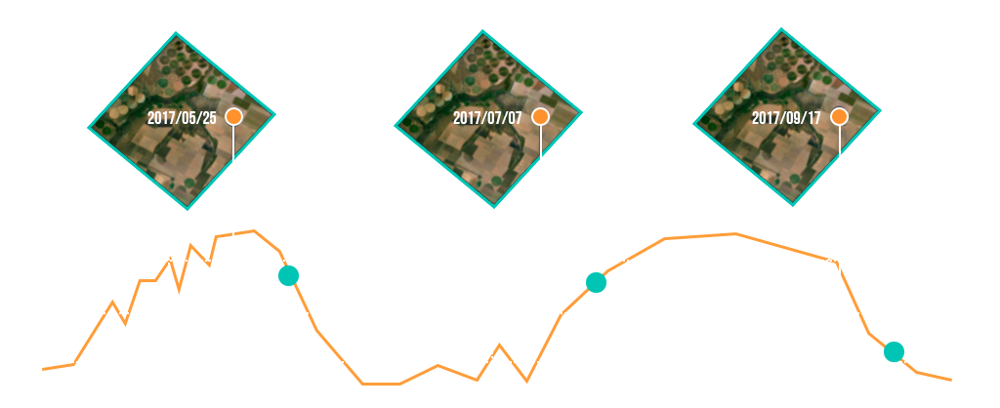

Bibliotecas clientes foram implementadas na linguagem de script Python e R e também foi desenvolvido um plugin para o
Sistema de Informação Geográfica QGIS.

Os clientes disponibilizam a operação dos serviços em alto nível. Além disso, os clientes do WTSS apoiam a construção de
aplicativos e uso em ambientes de computação interativos, como R Notebook ou Jupyter. Por exemplo, no cliente
desenvolvido em Python, denominado wtss.py, foi implementado um método de plot para a classe TimeSeries. Assim, todas as
séries temporais extraídas podem ser facilmente visualizadas, conforme apresentado na Figura 3.

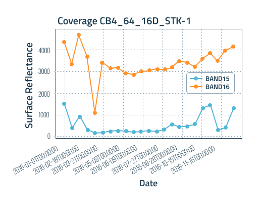

O WTSS pode ser usado em uma variedade de aplicações, como por exemplo, na validação e calibração de produtos derivados
de observações de satélites e geração e melhoria de mapas de uso e cobertura da terra.

Artigo referência:

Mais informações podem ser encontradas na organização do Brazil Data Cube no GitHub:

Especificação OpenAPI 3: https://github.com/brazil-data-cube/wtss-spec
Serviço WTSS : https://github.com/brazil-data-cube/wtss
Biblioteca Cliente em Python: https://github.com/brazil-data-cube/wtss.py
Python QGIS Plugin: https://github.com/brazil-data-cube/wtss-qgis
Artigo de referência:

Vinhas, L.; Queiroz, G. R.; Ferreira, K. R.; Camara, G. Web Services for Big Earth Observation Data. Revista Brasileira
de Cartografia, v. 69, n. 5, 18 maio 2017.

---

Brazil Data Cube é um projeto de pesquisa, desenvolvimento e inovação tecnológica do Instituto Nacional de Pesquisas
Espaciais (INPE), Brasil. Esse projeto está produzindo dados a partir de grandes volumes de imagens de sensoriamento
remoto de média resolução para todo o território nacional e desenvolvendo uma plataforma computacional para processar e
analisar esses dados usando inteligência artificial, aprendizado de máquina e análise de séries temporais de imagens.

Brazil Data Cube está inserido no projeto Monitoramento Ambiental dos Biomas Brasileiros, financiado pelo Fundo Amazônia
por meio da colaboração financeira do Banco Nacional de Desenvolvimento Econômico e Social (BNDES) e da Fundação de
Ciência, Aplicações e Tecnologia Espaciais (FUNCATE) nº 17.2.0536.1.

(1)    Web Time Series Service (WTSS): serviço web para extração de séries temporais a partir de coleções e cubos de
dados de imagens de sensoriamento remoto. Além do serviço web, esse produto inclui um cliente na linguagem de
programação python (wtss.py) e outro na linguagem de programação R (Rwtss). Link do Certificado

(2)    Web Land Trajectory Service (WLTS): serviço web para integração, harmonização e extração de trajetórias de uso e
cobertura da Terra a partir de mapas classificados. Além do serviço web, esse produto inclui um cliente na linguagem de
programação python (wlts.py) e outro na linguagem de programação R (Rwlts). Link do Certificado

(3)    Data Cube Builder: sistema para geração de cubos de dados de imagens de sensoriamento remoto em ambiente local ou
na nuvem AWS (Amazon Web Service). Link do Certificado

(4)    BDC Explorer: plataforma web para descoberta, visualização, análise e download de coleções e cubos de dados de
imagens de sensoriamento remoto e de trajetórias de uso e cobertura da Terra a partir de mapas classificados. Link do
Certificado

Todos esses sistemas são livres e de código fonte aberto e estão disponíveis no GitHub do projeto.

Quatro sistemas de softwares desenvolvidos no projeto Brazil Data Cube foram registrados no INPI (Instituto Nacional da
Propriedade Industrial)
A equipe do Brazil Data Cube acaba de registrar quatro sistemas de software desenvolvidos no projeto no Instituto
Nacional da Propriedade Industrial (INPI). O número de sistemas computacionais registrados no INPI é um dos indicadores
de produtividade do INPE e de seus cursos de pós-graduação.

Os sistemas registrados foram:

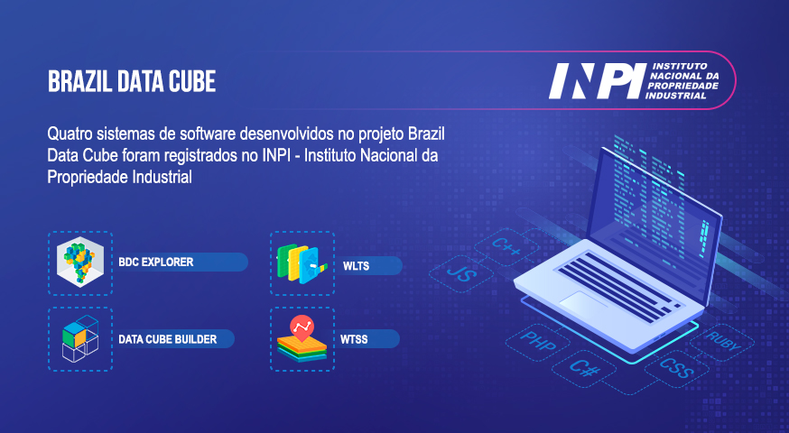

(1)    Web Time Series Service (WTSS): serviço web para extração de séries temporais a partir de coleções e cubos de
dados de imagens de sensoriamento remoto. Além do serviço web, esse produto inclui um cliente na linguagem de
programação python (wtss.py) e outro na linguagem de programação R (Rwtss). Link do Certificado

(2)    Web Land Trajectory Service (WLTS): serviço web para integração, harmonização e extração de trajetórias de uso e
cobertura da Terra a partir de mapas classificados. Além do serviço web, esse produto inclui um cliente na linguagem de
programação python (wlts.py) e outro na linguagem de programação R (Rwlts). Link do Certificado

(3)    Data Cube Builder: sistema para geração de cubos de dados de imagens de sensoriamento remoto em ambiente local ou
na nuvem AWS (Amazon Web Service). Link do Certificado

(4)    BDC Explorer: plataforma web para descoberta, visualização, análise e download de coleções e cubos de dados de
imagens de sensoriamento remoto e de trajetórias de uso e cobertura da Terra a partir de mapas classificados. Link do
Certificado

Todos esses sistemas são livres e de código fonte aberto e estão disponíveis no GitHub do projeto.

https://data.inpe.br/bdc/
https://data.inpe.br/bdc/explorer/
https://data.inpe.br/bdc/explorer/explore
https://data.inpe.br/bdc/wtss-web-time-series-service/
https://data.inpe.br/bdc/wlts-web-land-trajectory-service/
https://data.inpe.br/bdc/cube-builder/

Coleções de Imagens

Acervo de imagens de Reflectância de Superfície, ortorretificadas dos satélites CBERS-4, CBERS4A, Landsat-8 e Sentinel-2

As coleções de imagens são os produtos distribuídos pelo projeto BDC de modo que atendem os requisitos mínimos para
serem utilizados por aplicações. Essas coleções são obtidas em seus provedores de dados oficiais e redistribuídas, ou
distribuídas após processamentos, esses dados também são chamados produtos ARD (Analysis Ready Data) seguindo a
especificação CEOS ARD.

No contexto do BDC, coleções de imagens em nível digital e reflectância de topo de atmosfera são utilizadas para gerar
coleções em nível de reflectância de superfície para posteriormente serem utilizadas para gerar cubos de dados.

Cada imagem é processada com os softwares distribuídos pelas agências provedoras de imagens, por exemplo para imagens
Landsat-8 usa-se o processador LaSRC (Landsat Surface Reflectance Code), a Figura 2 ilustra o processamento de correção
atmosférica feito em diversos produtos para gerar produtos reflectância de superfície.
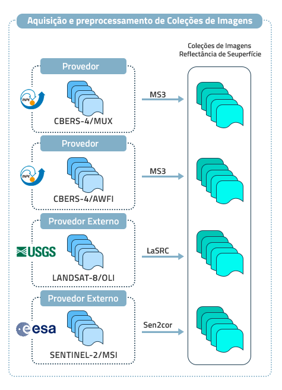

## TerraBrasilis Data Source

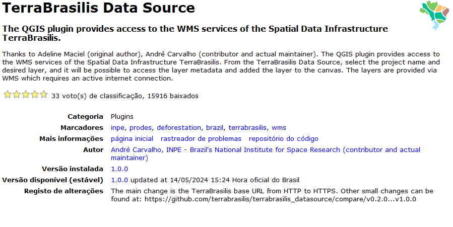

The QGIS plugin provides access to the WMS services of the Spatial Data Infrastructure TerraBrasilis.

Thanks to Adeline Maciel (original author), André Carvalho (contributor and actual maintainer). The QGIS plugin provides access to the WMS services of the Spatial Data Infrastructure TerraBrasilis. From the TerraBrasilis Data Source, select the project name and desired layer, and it will be possible to access the layer metadata and added the layer to the canvas. The layers are provided via WMS which requires an active internet connection.

33 voto(s) de classificação, 15916 baixados
Marcadores	wms, brazil, deforestation, inpe, terrabrasilis, prodes
Mais informações	página inicial   rastreador de problemas   repositório do código
Autor	André Carvalho, INPE - Brazil's National Institute for Space Research (contributor and actual maintainer)
Versão disponível (estável)	1.0.0 updated at 14/05/2024 15:24 Hora oficial do Brasil

## Galeria de códigos

Uma galeria de interessantes Jupyter Notebooks, R Markdown e scripts baseados nos dados e tecnologias do Brazil Data
Cube

Code Gallery possui um conjunto de documentos no formato do Jupyter Notebook ou R Markdown para ajudar os usuários do
Brazil Data Cube.

Documentos que podem misturar elementos de texto formatados, como tabelas e fórmulas com códigos nas linguagens R ou
Python para poder gerar gráficos, mapas e outras aplicações. A galeria de códigos que fica disponível abertamente no
GitHub para que as pessoas possam aprender com esses documentos e possam utilizar os serviços e aplicações do BDC.

O Brazil Data Cube também possui uma série de notebooks no ambiente do Kaggle.

O Kaggle permite a seus usuários encontrar datasets e construir modelos em um ambiente web nas linguagens Python e R. Os
notebook apresentam passo a passo como usar a biblioteca clientes para os serviços STAC (SpatioTemporal Asset Catalog),
WTSS (Web Time Series Service) e WLTS (Web Land Trajectory Service) e também a utilização do SITS R Package.

São apresentados alguns conceitos introdutórios sobre processamento digital de imagens e práticas com as imagens do
projeto Brazil Data Cube fornecidas pelo serviço STAC. É mostrado como utilizar o serviço WTSS para extrair séries
temporais do serviço Brazil Data Cube e como realizar uma manipulação básica de séries temporais. E também oferece uma
visão geral sobre como usar o WLTS para descobrir e acessar dados de trajetórias de cobertura e uso da terra de projetos
conhecidos, incluindo PRODES, DETER e TerraClass. Utilizando o SITS R Package também é apresentado como realizar a
classificação de séries temporais de satélite usando algoritmos de aprendizado de máquina e um conjunto de amostra
predefinido para gerar mapas temáticos classificados.

A plataforma Kaggle foi utilizada em diversos minicursos oferecidos pelo BDC. Alguns exemplos incluem: Workshop de
Computação Aplicada (WorCAP), evento do programa de Pós-Graduação em Computação Aplicada (CAP) do Instituto Nacional de
Pesquisas Espaciais (INPE). Workshop Brazil Data Cube com o Instituto Brasileiro de Geografia e Estatística (IBGE),
evento que reúne a comunidade técnico-científica, das áreas do Sensoriamento Remoto e Geotecnologias do IBGE para um
treinamento de utilização dos serviços, dados e ferramentas fornecidos pelo BDC para estudos de uso e cobertura da
terra. Simpósio Brasileiro de Sensoriamento Remoto 2021 (SBSR), evento que reúne a comunidade científica, técnicos e
usuários das áreas do Sensoriamento Remoto e Geotecnologias e suas aplicações para apresentar suas pesquisas mais
recentes e seus desenvolvimentos tecnológicos.

Para acessar os documentos acesse os links:
Code Gallery GitHub: https://github.com/brazil-data-cube/code-gallery

Brazil Data Cube Kaggle: https://www.kaggle.com/brazildatacube

## BDC complemento para qgis

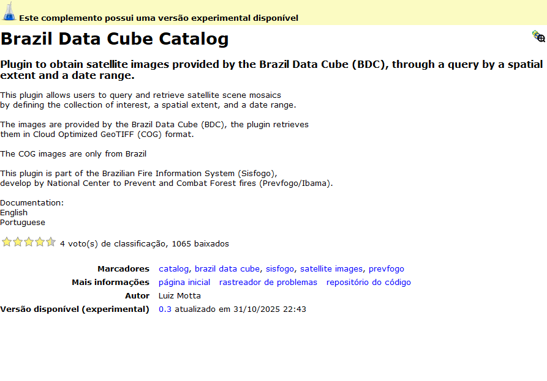

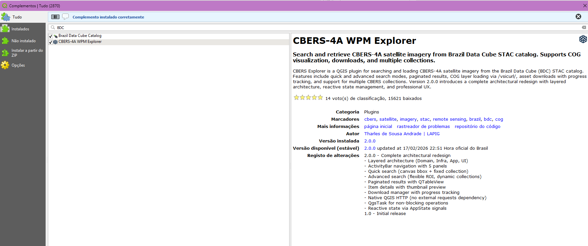

Fonte: Equipe do Brazil Data Cube

----

### Outros complementos para qgis

DesagregaBiomasBR

Assistente para seleção e desagregação de dados ambientais brasileiros (PRODES, DETER, TERRACLASS, ÁREA QUEIMADA)

Plugin que oferece um assistente guiado para seleção e desagregação de dados ambientais brasileiros por região ou
recorte espacial. Facilita o acesso e processamento de dados oficiais dos principais programas de monitoramento
ambiental do Brasil: PRODES (desmatamento), DETER (alertas), TERRACLASS (uso da terra) e ÁREA QUEIMADA (queimadas).
Inclui opções avançadas de corte espacial e múltiplos formatos de saída.
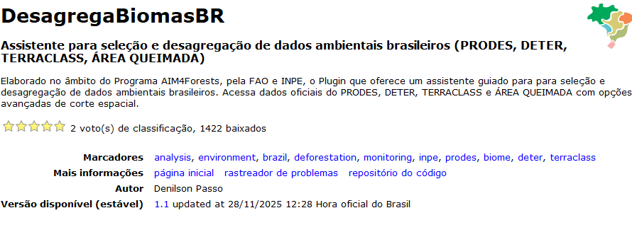

Monitoramento de Queimadas dNBR

Automated burn severity (dNBR) mapping and INPE fire risk analysis for forest fire monitoring.

This plugin provides a streamlined workflow for forest fire monitoring. It automates the calculation of the Differenced
Normalized Burn Ratio (dNBR) using Sentinel-2 satellite imagery to detect and classify burn severity. Additionally, it
integrates INPE's meteorological fire risk data (.nc files), allowing users to perform zonal statistics across municipal
boundaries to identify areas in critical alert states. Ideal for environmental analysts and researchers focused on
disaster management and biome preservation.
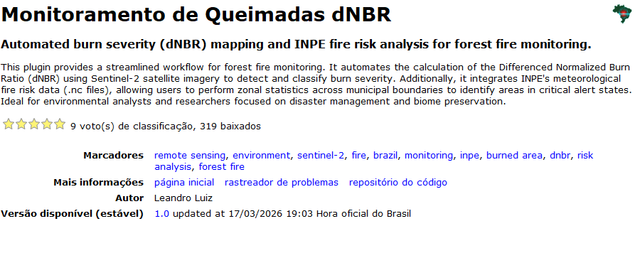

POLO

Automatically generates reports and maps of fire hotspots using NASA FIRMS and INPE data for the Amazon region

The POLO plugin, inspired by the messenger of the god Tupã, facilitates access to information on heat spots in the state of Amazonas. Integrated with QGIS, it automatically generates reports and maps using data from NASA's FIRMS and INPE. The plugin quantifies and locates heat spots in real-time and the past seven days, identifying priority areas by municipality and mesoregion. Designed for ease of use, it allows offline navigation with GeoPDFs on the Avenza Maps app for example.

2 voto(s) de classificação, 1588 baixados
Marcadores	report, geoprocessing, mapping, qgis, nasa, environment, fire, kernel density, monitoring, inpe, firms, hotspots, amazon, priority areas
Mais informações	página inicial   rastreador de problemas   repositório do código
Autor	Newton Coelho Monteiro
Versão disponível (estável)	0.9 updated at 11/02/2026 14:19 Hora oficial do Brasil
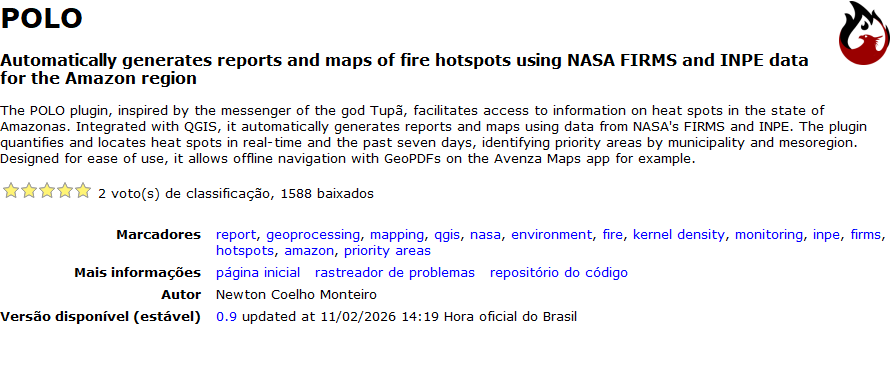

RTH PROJECT

O RTH PROJECT é um plugin QGIS voltado para agricultura de precisão e sensoriamento remoto, reunindo mais de 33 ferramentas ativas que cobrem todo o fluxo de trabalho, da aquisição de imagens de satélite até a exportação para equipamentos de campo. Por meio do RTH API Browser, o plugin integra catálogos STAC do INPE, Planetary Computer e AWS Element84, permitindo buscar, visualizar e baixar cenas de Sentinel-2, Landsat, CBERS e Amazônia-1 diretamente no QGIS, com reprojeção automática para o datum UTM regional e ajuste de contraste aplicado na abertura. Para análise de talhões, é possível calcular índices de vegetação como NDVI, EVI, SAVI, MSAVI e NDWI — ou fórmula personalizada — lendo apenas a região do polígono selecionado via COG, sem necessidade de baixar a cena completa. No contexto agrícola, o plugin oferece geração de linhas de plantio ou colheita com suporte a curvas, análise de azimute e métricas de regularidade das linhas existentes, criação de carreadores e exportação de planos de manejo para oito marcas de monitores agrícolas, incluindo formato ISO-XML para John Deere. Para operações com drones, estão disponíveis planejador de missão com cálculo automático de GSD e sobreposição, estimativa de baterias e tempo de voo com presets de modelos reais, exportação para Litchi, Mission Planner e KMZ, geração de ortomosaicos com GDAL e criação de MDEs e MDTs a partir de tiles de elevação ou nuvens de pontos LAS/LAZ. O plugin também centraliza o acesso a bases geográficas públicas brasileiras de órgãos como FUNAI, ANA, ICMBio, IBAMA, INCRA e ANEEL via catálogo WMS/WFS integrado, além de permitir o download de dados de desmatamento PRODES e modelos digitais de elevação de fontes como SRTM, Copernicus e AW3D. Para aumentar a produtividade no dia a dia, conta com aplicação de estilos e layouts de impressão com um clique, ciclo automático de visibilidade entre camadas por grupo, cálculo de área em hectares com projeção regional automática, importação e exportação de CSV de pontos GPS, conversão de pontos em polígonos via Concave Hull, revisor de polígonos com navegação automática, integração com Google Earth Pro e exportação para File Geodatabase compatível com ArcGIS. Completam o conjunto quatro aplicativos Google Earth Engine acessíveis diretamente pelo menu, voltados para análise temporal, séries de vegetação, dados climáticos e monitoramento de desmatamento.

The RTH PROJECT is a QGIS plugin focused on precision agriculture and remote sensing, bringing together more than 33 active tools that cover the entire workflow, from satellite image acquisition to field equipment export. Through the RTH API Browser, the plugin integrates STAC catalogs from INPE, Planetary Computer and AWS Element84, allowing users to search, visualize and download scenes from Sentinel-2, Landsat, CBERS and Amazônia-1 directly within QGIS, with automatic reprojection to the regional UTM datum and contrast enhancement applied on load. For field analysis, vegetation indices such as NDVI, EVI, SAVI, MSAVI and NDWI — or a custom formula — can be computed by reading only the selected polygon region via COG, with no need to download the full scene. On the agricultural side, the plugin provides generation of planting or harvesting lines with curve support, azimuth and regularity metric analysis of existing lines, headland creation, and export of management plans to eight brands of agricultural monitors, including ISO-XML format for John Deere. For drone operations, it includes a mission planner with automatic GSD and overlap calculation, battery count and flight time estimation with real drone model presets, export to Litchi, Mission Planner and KMZ, orthomosaic generation via GDAL, and DEM and DTM creation from elevation tiles or LAS/LAZ point clouds. The plugin also centralizes access to Brazilian public geographic databases from agencies such as FUNAI, ANA, ICMBio, IBAMA, INCRA and ANEEL through an integrated WMS/WFS catalog, and supports downloading PRODES deforestation data and digital elevation models from sources including SRTM, Copernicus and AW3D. For daily productivity, it offers one-click style and print layout application, automatic layer visibility cycling by group, area calculation in hectares with regional projection, GPS point CSV import and export, point-to-polygon conversion via Concave Hull, a polygon reviewer with automatic navigation, Google Earth Pro integration and export to ArcGIS-compatible File Geodatabase. Rounding out the toolset are four Google Earth Engine applications accessible directly from the menu, designed for temporal analysis, vegetation time series, climate data and deforestation monitoring.

27 voto(s) de classificação, 1384 baixados
Marcadores	python, raster, web, landsat, capture, dem, coordinate, sentinel, satellite, imagery, latitude, longitude, vrt, cbers, stac, amazonia
Mais informações	página inicial   rastreador de problemas   repositório do código
Autor	Luciano "Rithon" Junior
Versão disponível (estável)	1.2.7 updated at 03/06/2026 20:58 Hora oficial do Brasil

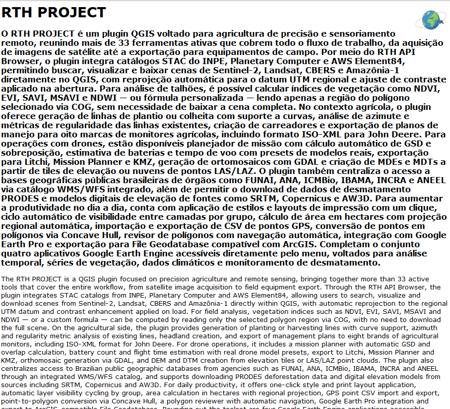