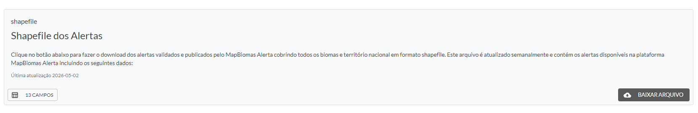
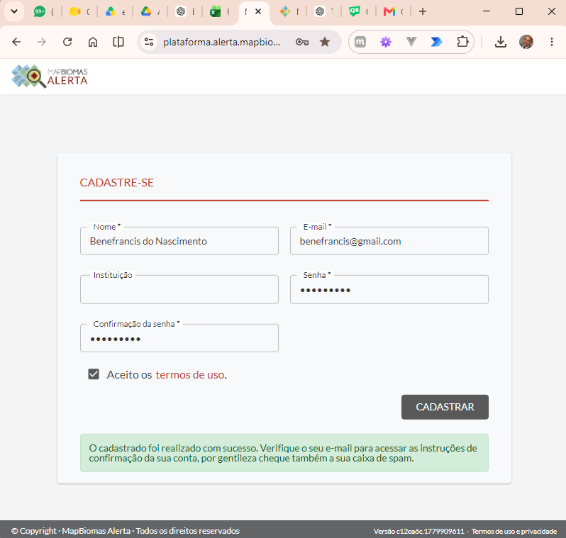
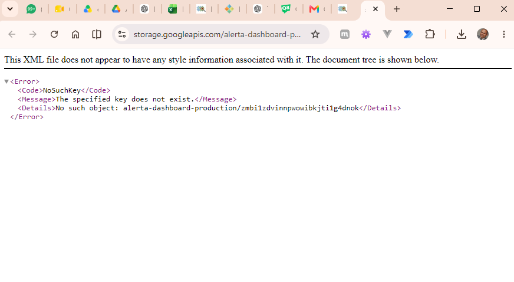
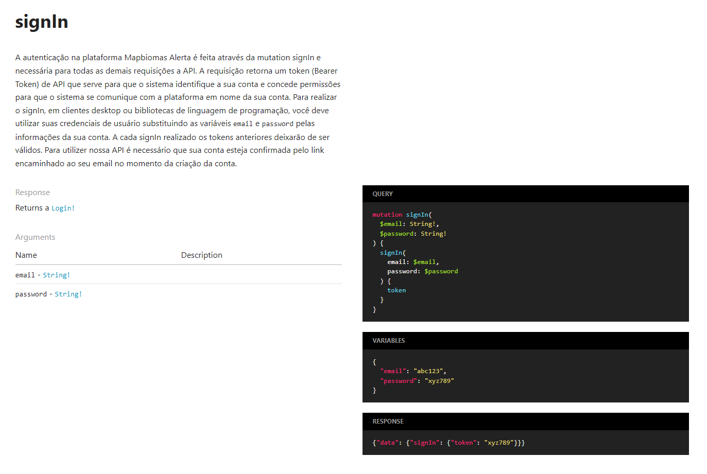
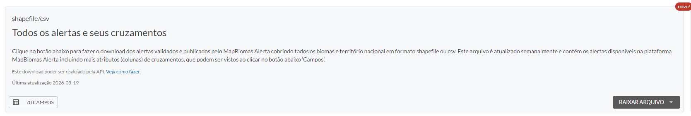
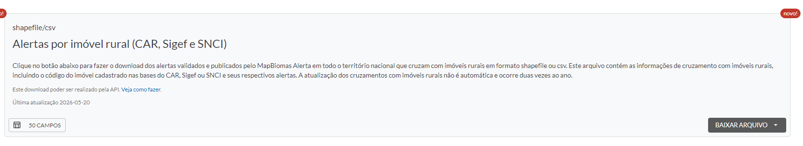

## Shapefile dos Alertas

Não é necessário ter conta na plataforma

Alerta cobrindo todos os biomas e território nacional em formato shapefile. Este arquivo é atualizado semanalmente e
contém os alertas disponíveis na plataforma MapBiomas Alerta incluindo os seguintes dados:

| Propriedade          | Tipo de Dados                   | Descrição                                                                           |
|----------------------|---------------------------------|-------------------------------------------------------------------------------------|
| codigo_alerta        | string                          | Identificador único do alerta na plataforma do MapBiomas Alerta.                    |
| bioma                | string                          | Bioma onde se localiza o alerta.                                                    |
| estado               | string                          | Estado onde se localiza o alerta.                                                   |
| municipio            | string                          | Município onde se localiza o alerta.                                                |
| area                 | decimal / float                 | Área do alerta em hectares.                                                         |
| ano_deteccao         | integer                         | Ano em que o alerta foi detectado pelos sistemas originadores (DETER, SAD ou GLAD). |
| data_deteccao        | date                            | Data em que o alerta foi detectado pelos sistemas originadores.                     |
| data_antes_deteccao  | date                            | Data da imagem anterior utilizada na detecção do alerta.                            |
| data_depois_deteccao | date                            | Data da imagem posterior utilizada na detecção do alerta.                           |
| vetor_pressao        | string / array<string>          | Vetor de pressão detectada para a área do alerta.                                   |
| geometria_alerta     | geometry (Polygon/MultiPolygon) | Polígono(s) que compõem o alerta.                                                   |
| fontes               | array<string> / string          | Fontes de detecção do alerta.                                                       |    

### Observações técnicas

* Última atualização 2026-05-02
* geometry (Polygon/MultiPolygon) é adequado para armazenamento em bancos espaciais como PostGIS.
* array<string> em fontes e vetor_pressao é útil caso existam múltiplos valores por alerta.
* Para APIs REST, uma alternativa comum seria representar datas em ISO 8601 (YYYY-MM-DD).
* Em banco geoespacial, area pode ser armazenado como NUMERIC(12,2) ou DOUBLE PRECISION.

---

## Opções de download para usuários com conta na plataforma

Fazendo o cadastramento

Email de verificação

Download com erro

Porém para acessar a API, basta fazer o login conforme imagem abaixo:

Fonte: https://plataforma.alerta.mapbiomas.org/api/docs/index.html#mutation-signIn

---

Todos os alertas e seus cruzamentos.

Alerta cobrindo todos os biomas e território nacional em formato shapefile ou csv. Este arquivo é atualizado
semanalmente e contém os alertas disponíveis na plataforma MapBiomas Alerta incluindo mais atributos (colunas) de
cruzamentos

| Propriedade                     | Tipo de Dados     | Descrição                                                                |
|---------------------------------|-------------------|--------------------------------------------------------------------------|
| after_dt                        | date              | Data da imagem posterior à detecção do alerta.                           |
| alert_code                      | string            | Código único do alerta.                                                  |
| alert_geometry_id               | bigint / uuid     | Identificador da geometria associada ao alerta.                          |
| area_ha                         | decimal(12,2)     | Área total do alerta em hectares.                                        |
| before_dt                       | date              | Data da imagem anterior à detecção do alerta.                            |
| biome                           | string            | Bioma predominante onde o alerta se encontra.                            |
| biome_area                      | decimal(12,2)     | Área de interseção do alerta com o bioma.                                |
| biome_id                        | integer / bigint  | Identificador do bioma.                                                  |
| car_area_max                    | decimal(12,2)     | Maior área de interseção com imóveis CAR.                                |
| car_area_min                    | decimal(12,2)     | Menor área de interseção com imóveis CAR.                                |
| car_area_sum                    | decimal(12,2)     | Soma das áreas dos CARs intersectados.                                   |
| car_area_sum_adj                | decimal(12,2)     | Soma ajustada das áreas dos CARs intersectados.                          |
| car_count                       | integer           | Quantidade de imóveis CAR intersectados.                                 |
| city                            | string            | Município predominante do alerta.                                        |
| city_area                       | decimal(12,2)     | Área de cruzamento com o município.                                      |
| city_id                         | integer / bigint  | Identificador do município.                                              |
| conservation_unit               | string            | Nome da Unidade de Conservação intersectada.                             |
| conservation_unit_area          | decimal(12,2)     | Área intersectada com Unidade de Conservação.                            |
| conservation_unit_id            | integer / bigint  | Identificador da Unidade de Conservação.                                 |
| days_interval                   | integer           | Quantidade de dias entre imagens ou eventos relacionados ao alerta.      |
| def_asv                         | boolean / integer | Indica cruzamento com Autorizações de Supressão da Vegetação (SINAFLOR). |
| def_asv_area                    | decimal(12,2)     | Área total autorizada por ASV intersectada.                              |
| def_efp                         | boolean / integer | Indicador de cruzamento com EFP.                                         |
| def_efp_area                    | decimal(12,2)     | Área total intersectada relacionada ao EFP.                              |
| def_pmfs                        | boolean / integer | Indica cruzamento com PMFS.                                              |
| def_pmfs_area                   | decimal(12,2)     | Área total intersectada com PMFS.                                        |
| def_poa                         | boolean / integer | Indica cruzamento com POA.                                               |
| def_poa_area                    | decimal(12,2)     | Área total intersectada com POA.                                         |
| def_uas                         | boolean / integer | Indicador de cruzamento com UAS.                                         |
| def_uas_area                    | decimal(12,2)     | Área total intersectada com UAS.                                         |
| detected_at                     | timestamp / date  | Data da detecção do alerta.                                              |
| detected_year                   | integer           | Ano da detecção do alerta.                                               |
| embargoed_properties_area_max   | decimal(12,2)     | Maior área intersectada com propriedades embargadas.                     |
| embargoed_properties_area_min   | decimal(12,2)     | Menor área intersectada com propriedades embargadas.                     |
| embargoed_properties_area_sum   | decimal(12,2)     | Soma das áreas embargadas intersectadas.                                 |
| embargoed_properties_count      | integer           | Quantidade de propriedades embargadas intersectadas.                     |
| embargoed_properties_count_area | decimal(12,2)     | Soma das áreas das propriedades embargadas.                              |
| id                              | bigint / uuid     | Identificador interno do registro.                                       |
| indigenous_land                 | string            | Nome da Terra Indígena intersectada.                                     |
| indigenous_land_area            | decimal(12,2)     | Área de cruzamento com Terra Indígena.                                   |
| indigenous_land_id              | integer / bigint  | Identificador da Terra Indígena.                                         |
| legal_reserve_area_max          | decimal(12,2)     | Maior área intersectada com Reserva Legal.                               |
| legal_reserve_area_min          | decimal(12,2)     | Menor área intersectada com Reserva Legal.                               |
| legal_reserve_area_sum          | decimal(12,2)     | Soma das áreas de Reserva Legal intersectadas.                           |
| legal_reserve_area_sum_adj      | decimal(12,2)     | Soma ajustada das áreas de Reserva Legal.                                |
| legal_reserve_count             | integer           | Quantidade de cruzamentos com Reserva Legal.                             |
| ppa_area_max                    | decimal(12,2)     | Maior área intersectada com APP.                                         |
| ppa_area_min                    | decimal(12,2)     | Menor área intersectada com APP.                                         |
| ppa_area_sum                    | decimal(12,2)     | Soma das áreas de APP intersectadas.                                     |
| ppa_area_sum_adj                | decimal(12,2)     | Soma ajustada das áreas de APP intersectadas.                            |
| ppa_count                       | integer           | Quantidade de cruzamentos com APP.                                       |
| quilombo                        | string            | Nome do território quilombola intersectado.                              |
| quilombo_area                   | decimal(12,2)     | Área intersectada com território quilombola.                             |
| quilombo_id                     | integer / bigint  | Identificador do território quilombola.                                  |
| river_source_count              | integer           | Quantidade de nascentes intersectadas.                                   |
| settlement                      | string            | Nome do assentamento intersectado.                                       |
| settlement_area                 | decimal(12,2)     | Área intersectada com assentamento.                                      |
| settlement_id                   | integer / bigint  | Identificador do assentamento.                                           |
| source                          | string            | Fonte original utilizada para validação/refinamento do alerta.           |
| state                           | string            | Estado predominante onde se localiza o alerta.                           |
| state_area                      | decimal(12,2)     | Área intersectada com o estado.                                          |
| state_id                        | integer / bigint  | Identificador do estado.                                                 |
| status                          | string / integer  | Status atual do alerta.                                                  |
| status_desc                     | string            | Descrição textual do status do alerta.                                   |
| watershed_l1                    | string            | Nome da bacia hidrográfica nível 1.                                      |
| watershed_l1_area               | decimal(12,2)     | Área intersectada com a bacia nível 1.                                   |
| watershed_l1_id                 | integer / bigint  | Identificador da bacia nível 1.                                          |
| watershed_l2                    | string            | Nome da bacia hidrográfica nível 2.                                      |
| watershed_l2_area               | decimal(12,2)     | Área intersectada com a bacia nível 2.                                   |
| watershed_l2_id                 | integer / bigint  | Identificador da bacia nível 2.                                          |

NOTA INFORMATIVA - COBERTURA

Atualizado em: 04/2026

A Coleção 10.1 do MapBiomas inclui os mapas e dados anuais de cobertura e uso da terra do Brasil para o período de 1985
a 2024, com resolução de 30 metros. Esta coleção é fruto de dez anos de trabalho do projeto MapBiomas e está em
constante desenvolvimento. Esta versão possui resolução temporal de um ano e permite que o usuário escolha o período de
interesse. Informações sobre a acurácia deste mapeamento do Brasil e dos biomas, tanto geral quanto por classe de
cobertura e uso da terra para cada ano, são apresentadas na página de análise de
acurácia (https://mapbiomas.org/analise-de-acuracia).

Para maiores informações sobre o método, acesse o ATBD:

https://brasil.mapbiomas.org/download-dos-atbds-com-metodo-detalhado/

A Coleção 10.1 foi disponibilizada para ajustar os dados históricos entre 1985 e 2003 da classe de “Rio, Lago e
Oceano” (ID: 33) no bioma Amazônia e correção de alguns pixels sem informação (NODATA) na Amazônia, Pampa e nas áreas
litorâneas e de fronteira onde existia incompatibilidade entre as bases oficiais 1:250.000 dos estados e biomas do IBGE.

A Coleção 3 (beta) do MapBiomas 10 metros inclui mapas anuais de cobertura e uso da terra para o período de 2017 a
2024 (período de disponibilidade de imagens do satélite Sentinel-2 e Satellite Embedding - AlphaEarth
Foundations/Google).

Para maiores informações sobre o método e download destes dados, acesse a
página: https://brasil.mapbiomas.org/mapbiomas-cobertura-10m/

A Coleção 3 (beta) Cobertura 10 m do MapBiomas inclui mapas anuais de cobertura e uso da terra do Brasil para o período
de 2017 a 2024, com 10 metros de resolução, a partir da classificação de imagens dos satélites Sentinel-2, permitindo a
inclusão de informações de maior detalhe no mapeamento em comparação com o dado de 30 m de resolução, como por exemplo
florestas ripárias em Áreas de Preservação Permanente (APP) ao longo dos rios e nascentes.

As transições entre classes em um período selecionado são apresentadas em mapas, gráficos, diagrama de Sankey e matriz
de transição. As transições representam as mudanças de classes de cobertura e uso da terra, mas também podem incluir
inconsistências entre as classificações.

A ferramenta Número de Classes contabiliza a quantidade de classes de cobertura e uso da terra em que um pixel foi
classificado durante a extensão temporal selecionada, de acordo com as Coleções 10.1 e Coleção 3 (beta) 10 m do
MapBiomas, representando a diversidade de classes em que cada pixel foi classificado durante o período.

A ferramenta Número de Mudanças contabiliza a quantidade de mudanças entre classes de cobertura e uso da terra que
ocorreram durante a extensão temporal selecionada, de acordo com as Coleções 10.1 e Coleção 3 (beta) 10 m do MapBiomas,
indicando a dinâmica de transição entre classes de cada pixel.

A ferramenta Áreas Estáveis mostra áreas que permaneceram com a mesma classe de cobertura e uso da terra durante toda a
extensão temporal selecionada, de acordo com as Coleções 10.1 e Coleção 3 (beta) 10 m do MapBiomas. A configuração
padrão da plataforma exibe resultados considerando todas as classes no nível 4 da legenda, porém os dados também podem
ser obtidos para qualquer classe e nível.

Caso tenha sugestões, críticas e ideias para aprimorar o produto entre em contato pelo e-mail: contato@mapbiomas.org

Os dados do MapBiomas são públicos, abertos e gratuitos sob licença CC-BY e mediante a referência da fonte observando o
seguinte formato: "Projeto MapBiomas – Coleção [versão] da Série Anual de Mapas de Cobertura e Uso da Terra do Brasil,
acessado em [data] através do link: [LINK]".

Acesse a publicação científica de referência: Souza at. al. (2020) - Reconstructing Three Decades of Land Use and Land
Cover Changes in Brazilian Biomes with Landsat Archive and Earth Engine - Remote Sensing, Volume 12, Issue 17,
10.3390/rs12172735.

---

Alertas por imóvel rural (CAR, Sigef e SNCI)

Alerta em todo o território nacional que cruzam com imóveis rurais em formato shapefile ou csv. Este arquivo contém as
informações de cruzamento com imóveis rurais, incluindo o código do imóvel cadastrado nas bases do CAR, Sigef ou SNCI e
seus respectivos alertas. A atualização dos cruzamentos com imóveis rurais não é automática e ocorre duas vezes ao ano.

| Propriedade                   | Tipo de Dados     | Descrição                                                                 |
|-------------------------------|-------------------|---------------------------------------------------------------------------|
| alert_car_after_dt            | date              | Data da imagem posterior à detecção do alerta/CAR.                        |
| alert_car_area_ha             | decimal(12,2)     | Área do CAR sobreposta ao alerta, em hectares.                            |
| alert_car_asv                 | boolean / integer | Indicador de cruzamento com Autorizações de Supressão da Vegetação (ASV). |
| alert_car_asv_area_ha         | decimal(12,2)     | Área intersectada com ASV relacionada ao alerta/CAR.                      |
| alert_car_before_dt           | date              | Data da imagem anterior à detecção do alerta/CAR.                         |
| alert_car_days_interval       | integer           | Intervalo de dias entre as imagens anterior e posterior à detecção.       |
| alert_car_efp                 | boolean / integer | Indicador de cruzamento com EFP.                                          |
| alert_car_efp_area_ha         | decimal(12,2)     | Área intersectada relacionada ao EFP.                                     |
| alert_car_indigenous_area_ha  | decimal(12,2)     | Área intersectada entre alerta/CAR e Terras Indígenas.                    |
| alert_car_indigenous_land     | string            | Código ou identificação da Terra Indígena incidente sobre o alerta/CAR.   |
| alert_car_indigenous_land_id  | integer / bigint  | Identificador da Terra Indígena.                                          |
| alert_car_pmfs                | string / integer  | Código do Plano de Manejo Florestal Sustentável (PMFS).                   |
| alert_car_pmfs_area_ha        | decimal(12,2)     | Área intersectada com PMFS.                                               |
| alert_car_poa                 | boolean / integer | Indicador de cruzamento com Plano Operacional Anual (POA).                |
| alert_car_poa_area_ha         | decimal(12,2)     | Área intersectada com POA.                                                |
| alert_car_quilombo            | string            | Código ou identificação do território quilombola incidente.               |
| alert_car_quilombo_area       | decimal(12,2)     | Área intersectada com territórios quilombolas.                            |
| alert_car_quilombo_id         | integer / bigint  | Identificador do território quilombola.                                   |
| alert_car_settlements         | string            | Código ou identificação do assentamento incidente.                        |
| alert_car_settlements_area_ha | decimal(12,2)     | Área intersectada com assentamentos.                                      |
| alert_car_settlements_id      | integer / bigint  | Identificador do assentamento.                                            |
| alert_car_uas                 | boolean / integer | Indicador de cruzamento com UAS.                                          |
| alert_car_uas_area_ha         | decimal(12,2)     | Área intersectada com UAS.                                                |
| alert_car_uc_area_ha          | decimal(12,2)     | Área intersectada com Unidade de Conservação.                             |
| alert_car_uc_id               | integer / bigint  | Identificador da Unidade de Conservação.                                  |
| alert_car_uc_unit             | string            | Nome da Unidade de Conservação incidente.                                 |
| alert_code                    | string            | Código do alerta.                                                         |
| alert_geometry_id             | bigint / uuid     | Identificador da geometria associada ao alerta.                           |
| alert_id                      | bigint / uuid     | Identificador interno do alerta.                                          |
| alert_legal_reserve_area_ha   | decimal(12,2)     | Área da Reserva Legal intersectada com alerta/CAR.                        |
| alert_ppa_area_ha             | decimal(12,2)     | Área de APP intersectada com alerta/CAR.                                  |
| alert_river_source_count      | integer           | Quantidade de nascentes intersectadas.                                    |
| alert_total_area_ha           | decimal(12,2)     | Área total do alerta em hectares.                                         |
| biome                         | string            | Bioma predominante onde o alerta está localizado.                         |
| biome_id                      | integer / bigint  | Identificador do bioma.                                                   |
| car_area_ha                   | decimal(12,2)     | Área total do imóvel CAR.                                                 |
| car_code                      | string            | Código do Cadastro Ambiental Rural (CAR).                                 |
| car_embargoed_area_ha         | decimal(12,2)     | Área total embargada intersectada com o alerta.                           |
| car_embargoed_count           | integer           | Quantidade de CARs embargados intersectados.                              |
| city                          | string            | Município predominante do alerta.                                         |
| city_id                       | integer / bigint  | Identificador do município.                                               |
| detected_at                   | timestamp / date  | Data de detecção do alerta.                                               |
| detected_year                 | integer           | Ano de detecção do alerta.                                                |
| legal_reserve_area_ha         | decimal(12,2)     | Área de Reserva Legal intersectada.                                       |
| ppa_area_ha                   | decimal(12,2)     | Área de Preservação Permanente intersectada.                              |
| rural_property_id             | string / bigint   | Identificador do imóvel rural (CAR).                                      |
| source                        | string            | Fonte original do alerta utilizada na validação/refinamento.              |
| state                         | string            | Estado predominante onde o alerta está localizado.                        |
| state_id                      | integer / bigint  | Identificador do estado.                                                  |

### Observações técnicas

* Mantive decimal(12,2) para áreas em hectares por consistência geoespacial.
* Campos como alert_car_asv, alert_car_pmfs, alert_car_poa, alert_car_uas foram modelados como boolean / integer, pois
  datasets ambientais frequentemente usam 0/1, S/N ou true/false.
* Notei que alert_car_pmfs_area_ha apareceu duplicado na origem; mantive apenas uma ocorrência.
* Para PostGIS, seria recomendável complementar esse esquema com: geometry geometry(MultiPolygon, 4674)

 ---

