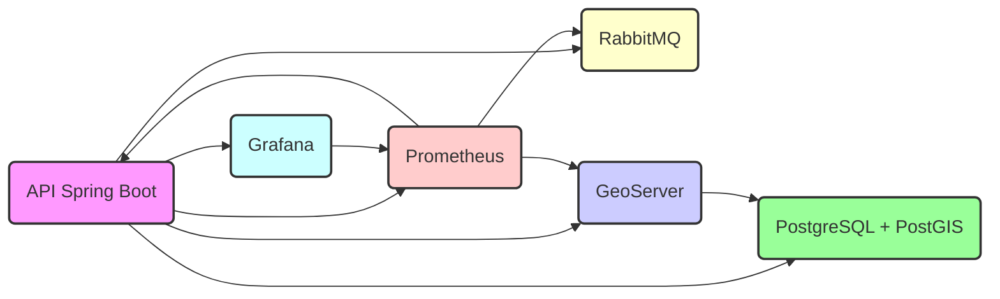

# MyPosition

[Logotipo do Projeto (se tiver)](URL_DO_SEU_LOGOTIPO)

## Descrição

Este projeto é uma plataforma de mapas que utiliza diversas tecnologias para prover serviços geoespaciais, manipulação
de dados geográficos, monitoramento e visualização. A arquitetura envolve um back-end Spring Boot, GeoServer, PostgreSQL
com PostGIS, RabbitMQ para mensageria, Prometheus para monitoramento e Grafana para visualização de métricas.


## Importanto dados de Shapfiles

```shell
shp2pgsql -c -D -s 4326 -I -W LATIN1 aldeias_pontos/aldeias_pontosPoint.shp mapas.aldeias_pontos | psql -U postgre
s -d mapas

shp2pgsql -c -D -s 4326 -I -W LATIN1 aldeias_pontos/aldeias_pontosPoint.shp mapas.tb_aldeias_pontos | psql -U post
gres -d mapas

shp2pgsql -c -D -s 4326 -I -W LATIN1 tis_amazonia_legal_poligonais/tis_amazonia_legal_poligonaisPolygon.shp mapas.
tb_tis_amazonia_legal_poligonais | psql -U postgres -d mapas
 
shp2pgsql -c -D -s 4326 -I -W LATIN1 tis_cr/tis_crPoint.shp mapas.tb_tis_cr_point | psql -U postgres -d mapas


shp2pgsql -c -D -s 4326 -I -W LATIN1 quilombolas/Áreas de Quilombolas.shp mapas.tb_quilombolas | psql -U postgres -d mapas
```

# Instalando o GDAL

```prompt
docker exec -i db4mapas bash -c "apt-get update && apt-get install -y gdal-bin"
```


## Diagrama de Arquitetura



## Funcionalidades Principais

* **Página Inicial:** Exibe a página principal do site (`index.html`).
* **Atualização de Posição:** Fornece um endpoint JSON (`/update-position`) que retorna uma posição geográfica (latitude
  e longitude).
* **Serviços Geoespaciais:** O GeoServer provê serviços WMS, WFS e WCS, para disponibilizar dados vetoriais e raster.
* **Persistência:** O PostgreSQL com a extensão PostGIS é utilizado para o armazenamento de dados geográficos.
* **Mensageria:** O RabbitMQ faz o gerenciamento de filas para comunicação entre serviços.
* **Monitoramento:** O Prometheus coleta métricas dos componentes do sistema.
* **Visualização:** O Grafana é usado para visualizar as métricas de forma gráfica, auxiliando no monitoramento dos
  serviços.

## Como Começar

1. **Pré-requisitos:**
    * [Docker](https://docs.docker.com/get-docker/): Necessário para executar a aplicação em containers.
    * [Docker Compose](https://docs.docker.com/compose/install/): Necessário para orquestração dos containers.
    * [Maven](https://maven.apache.org/download.cgi): Necessário para buildar o projeto java.
        * Certifique-se que você tem o JDK 17 instalado corretamente.
2. **Instalação:**

   ```bash
   # Clone o repositório
   git clone <URL_DO_SEU_REPOSITÓRIO>
   cd <DIRETÓRIO_DO_PROJETO>
   ```
3. **Configuração:**
    * Crie um arquivo chamado `.env` e configure suas variáveis de ambiente, como a porta do servidor (`SERVER_PORT`),
      usuário do Postgres, nome do banco de dados e outras variáveis específicas da sua aplicação. Exemplo:
       ```env
        PROFILE=producao
        CONTAINER_NAME=mapas
        SERVER_PORT=80
        
        POSTGRES_IMAGE=postgis/postgis:latest
        POSTGRES_SERVER=db
        POSTGRES_PORT=5432
        POSTGRES_NAME=mapas
        POSTGRES_USERNAME=postgres # Troque esta senha
        POSTGRES_PASSWORD=postgres # Troque esta senha
        POSTGRES_ROOT_PASSWORD=root # Troque esta senha
        POSTGRES_TIMEZONE=America/Sao_Paulo
        
        GEOSERVER_ADMIN_USERNAME=admin # Troque esta senha
        GEOSERVER_ADMIN_PASSWORD=geoserver # Troque esta senha
        
        GEOSERVER_IMAGE=geosolutionsit/geoserver:2.26.x
       ```
    * Configure seu arquivo `rabbitmq_setup.sh` com as credenciais de acesso para seu broker e usuário.
    * Opcionalmente, crie o arquivo `erlang.config` para configurações mais avançadas do Erlang (consulte a
      documentação).
    * Opcionalmente, crie o arquivo `prometheus.yml` para configurações do prometheus.
4. **Execução:**
   ```bash
   # Inicie os containers
   docker-compose up -d --force-recreate
   ```
    * Acesse a aplicação em `http://localhost:80` (se a porta no `.env` estiver configurada com o valor 80).
    * Acesse o painel do GeoServer em `http://localhost:8080` (usuário `admin`, senha `geoserver`, caso não tenha
      alterado).
    * Acesse o painel do RabbitMQ em `http://localhost:15672` (usuário `web`, senha `rabbitmq`).
    * Acesse o painel do Prometheus em `http://localhost:9090`.
    * Acesse o painel do Grafana em `http://localhost:3000`.

## Uso Básico

* **Acesso à Página Inicial:**
    * Acesse `http://localhost:80` no seu navegador para visualizar a página inicial do seu site.
* **Atualização de Posição:**
    * Faça uma requisição HTTP GET em `http://localhost:80/update-position` para receber um JSON com a latitude e
      longitude (-23.5505 e -46.6333 por padrão).

## Configurações Adicionais

* **Variáveis de Ambiente:** Consulte o arquivo `.env` para configurações específicas da sua aplicação.
* **Arquivo `rabbitmq_setup.sh`:** Configure as credenciais e permissões do seu RabbitMQ e seus usuários neste arquivo.
* **Arquivo `erlang.config`:** Opcionalmente, configure o comportamento do Erlang, útil em ambientes de cluster ou
  configurações customizadas.
* **Arquivo `prometheus.yml`:** Opcionalmente, configure o Prometheus com configurações customizadas.

## Ambientes de Execução

* **Local/Desenvolvimento:** Execute o compose diretamente na sua máquina utilizando o comando `docker-compose up -d`.
* **Produção:** Use uma solução de orquestração como Docker Swarm ou Kubernetes e utilize volumes nomeados para
  persistir os seus dados. Para uma melhor disponibilidade, execute múltiplas instancias do seu GeoServer por trás de um
  load balancer.

## Tecnologias Usadas

* Linguagem: Java 17
* Framework: Spring Boot 3.2
* Banco de Dados: PostgreSQL + PostGIS
* Mensageria: RabbitMQ 4.0
* Servidor Geoespacial: GeoServer 2.26
* Monitoramento: Prometheus 3.1, Grafana 9.1
* Containerização: Docker Compose

## Contribuição

* Se você encontrar problemas, crie uma *issue* no repositório.
* Se você tem alguma sugestão de funcionalidade, utilize os *discussions* do projeto.
* Siga as convenções de nomes, de código, e crie testes unitários antes de criar sua *pull request*.

## Licença

[MIT License](URL_DA_LICENÇA_MIT)

## Autores

* Benefrancis/Github: @Benefrancis

## Contato

* Email: benefrancis@email.com
* [Linkedin](https://www.linkedin.com/in/benefrancis/)

## Status do Projeto

Em desenvolvimento

## Disclaimer

* O projeto foi desenvolvido sem fins lucrativos.

## Links Úteis

* Repositório no GitHub: (Link para seu repo)
* Documentação da API: (Link para a documentação, se houver)
* Documentação do RabbitMQ: (Link para documentação)
* Documentação do GeoServer: (Link para documentação)
* Documentação do Spring Boot: (Link para documentação)

```plantuml

@startuml
actor "Usuário do Sistema" as Usuario
actor "Técnico" as Tecnico
actor "Conselheiro Titular" as Conselheiro
actor "Conselheiro Suplente" as Suplente
actor "Sistema" as Sistema

Usuario -> (Cadastrar Território)

Sistema -> (Sortear Técnico para Avaliação)
Sistema -> Tecnico : Notificar distribuição

Tecnico -> (Emitir Parecer Técnico)

Sistema -> (Notificar Técnico sobre Prazo)
Sistema -> Tecnico : Enviar lembrete diário (últimos 5 dias)

Sistema -> (Redistribuir Território para Novo Técnico)
Sistema -> Tecnico : Redistribuir após 30 dias sem parecer

Conselheiro -> (Votar no Território)
Sistema -> (Aprovar Automaticamente ao Atingir Metade dos Votos)

Sistema -> (Liberar Voto de Conselheiros Suplentes)
Suplente -> (Votar no Território)

@enduml

```


